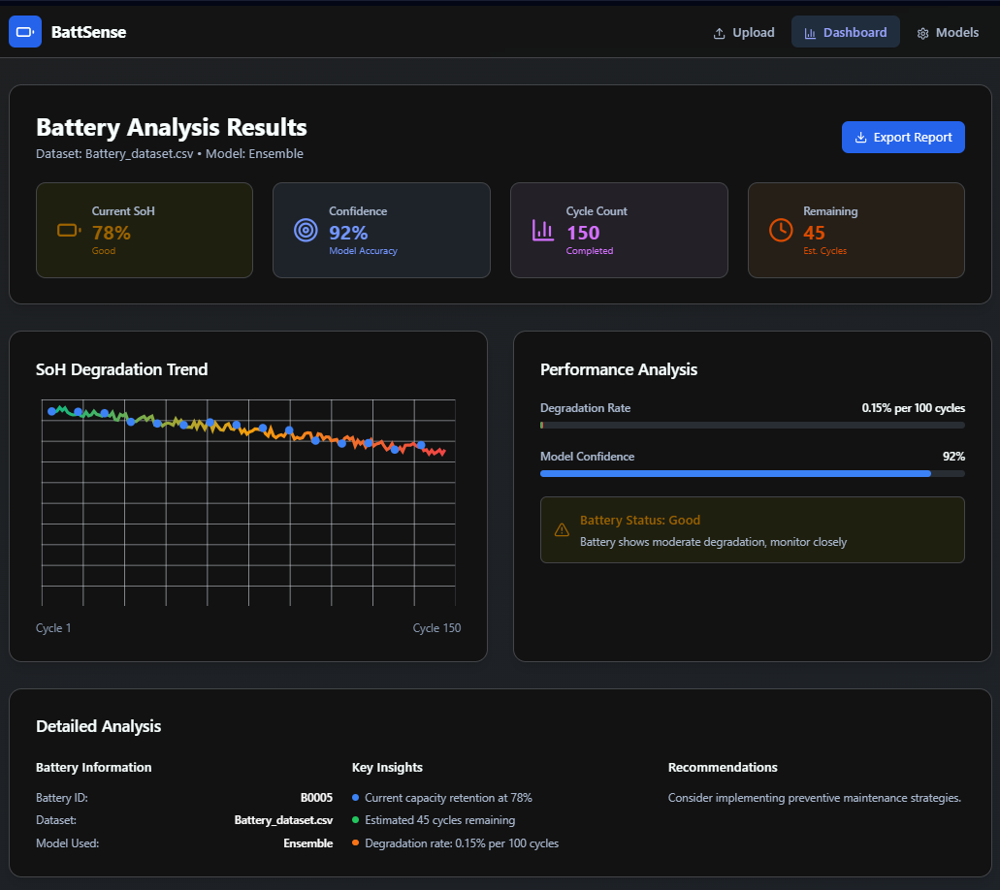

# ⚡ BattSense – Battery Health Prediction Web App

[](https://battsense.netlify.app)
[](https://x.com/Sharvesh_14)

<table>
  <tr>
    <td>
      
    </td>
    <td>
      
    </td>
  </tr>
</table>

<br/>

> “Predict battery health with real data, real models — and real-time AI assistance.”

---

## 🌐 Overview

**BattSense** is a web-based tool that predicts the **State of Health (SOH)** of lithium-ion batteries using machine learning.

It bridges the gap between raw sensor data and practical diagnostics through an interactive, browser-based dashboard.

Built with **React + Vite + Tailwind CSS**, this frontend is paired with a trained ML model and enhanced with **DeepSeek AI** for intelligent analysis.

---

## 🔍 Key Features

- 🔋 Predict SOH based on voltage, cycles, capacity, and temperature
- 🧠 Powered by a **Random Forest Regressor** trained on real data
- 💬 Built-in chatbot assistant using **DeepSeek API**
- 📊 Sample output visualization + **Downloadable results**
- 🧪 Configured for both web and ML experimentation

---

## 📦 Tech Stack


**Also includes:**

- 📦 **PostCSS** – custom styling and plugin support  
- 🧪 **Jest** – unit testing  
- 🧭 **ESLint** – consistent code formatting  
- 🧱 **Recharts** – data visualization  
- 🧠 **DeepSeek API** – conversational AI assistant  
- 📁 **Modular file aliasing** via Vite config

---

## 🖼️ Sample Output



> After prediction, the result is displayed and can be **downloaded** as a CSV for further analysis or reporting.

---

## 🧠 ML Model Details

- Model: **Random Forest Regressor**
- Dataset includes:
  - Voltage  
  - Current  
  - Temperature  
  - Charge cycles  
  - Capacity
- Target: **State of Health (SOH)**

Handled:
- Missing values  
- Outliers  
- Feature selection  

**Metrics Used:**
- Mean Squared Error (MSE)  
- Root Mean Squared Error (RMSE)  
- Mean Absolute Error (MAE)  
- R² Score *(coming soon)*

---

## 🚀 Getting Started

```bash
# Clone the repo
git clone https://github.com/sharvesh1401/BattSense.git
cd BattSense

# Install frontend dependencies
npm install

# Run the local dev server
npm run dev
```

> For backend ML model usage, refer to `battery_soh_predictor.py` (not included in web build).

---

## 📁 Project Structure

```
├── src/                  # Frontend components & views
├── image_*.png           # Sample output graph
├── public/               # Static assets
├── index.html
├── package.json
├── vite.config.ts
├── tailwind.config.js
├── postcss.config.js
├── jest.config.cjs
└── tsconfig.*.json       # TypeScript config files
```

---

## 🛠 Improvements Planned

- [ ] Connect directly to Python backend for live predictions  
- [ ] Add downloadable dataset sample  
- [ ] Expand model support (XGBoost, MLP)  
- [ ] Add user authentication (optional)

---

## 🙋‍♂️ About Me

I'm **Sharvesh Selvakumar**, an engineering student passionate about AI, clean energy, and responsible tech.

🔗 [sharveshfolio.netlify.app](https://sharveshfolio.netlify.app)  
🐦 [@Sharvesh_14](https://x.com/Sharvesh_14)

---

> ⚡ Built for smarter batteries and better energy tech.  
> MIT License | © 2025 Sharvesh Selvakumar
